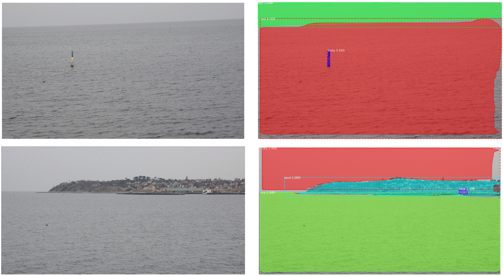
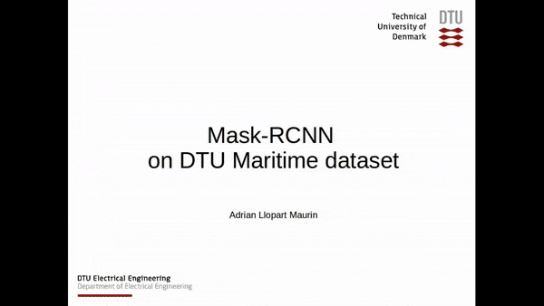

# Train your own dataset with Mask R-CNN (DTU Maritime Dataset example)

This repository tries to simplify the process of creating a Dataset and training Mask R-CNN from scratch. Specifically, a maritime dataset of 176 images is created which include 5 classes: buoys (green), land (red), sea (dark blue), sky (turquoise) and ships (white). Training this dataset on Mask R-CNN allows the semantic segmentation of live video coming from cameras on board an maritime vessel, enabling it, in the future, to recognize, understand and act upon its surroundings autonomously.


For more information on [Mask R-CNN](https://arxiv.org/abs/1703.06870) please visit their official github repo (https://github.com/matterport/Mask_RCNN) or their paper. 

The repository includes:
* Source code forked from the official Mask R-CNN repository.
* The handmade Maritime Dataset
* Instructions on how to train from scratch your network
* A jupyter notebook to visualize the detection pipeline
* Code for running the detection on a simple webcam or under the ROS framework

# Getting Started

* All code has been tested under the Tensorflow 1.7 environment. Please follow (https://www.tensorflow.org/install/) for more information on how to install tensorflow on your machine.

* Follow [Mask R-CNN](https://github.com/matterport/Mask_RCNN) for installation instructions.

* Create your own dataset: find enough images to represent broadly all the classes you aim to detect. Use the LabelMe python software to create *.json* files that include the polygonal representation of the masked classes. LabelMe can be installed under the tensorflow environment from [LabelMe](https://github.com/wkentaro/labelme) or with:
   ```bash
   pip install labelme
   ```

* Prepare your dataset: edit the *image_list.txt* and *labels.txt* files accordingly. Convert all *.jpg* files to *.png* if necessary.

* [loader.py](Train_own_dataset/training_codes/loader.py) creates a mask for every instance of every class of every image in your training set. If the *.json* files have not been created by *LabelMe*, then the [JSON_parser.py](Train_own_dataset/training_codes/JSON_parser.py) file will most likely need to be modified.
 ```bash
   python loader.py
   ```

* Create a validation folder and add some of the training images there (at least one).

* [showdata.py](mrcnn/showdata.py) to visualize the created instance masks. Usage:
   ```bash
   python showdata.py N (where N is the number of image in training folder (f.ex. 00025)).
   ```

*  Download pre-trained COCO weights (mask_rcnn_coco.h5) from the [releases page](https://github.com/matterport/Mask_RCNN/releases).

* To start training the network please create your own config file or modify [maritime.py](mrcnn/maritime.py). Start training, using the pre-generated COCO weights as starting point, with:
 ```bash
   python maritime.py --dataset="/path/to/dataset/" --model="coco"
   ```
The weights will be saved every epoch in the *logs* folder.

* [maritime.ipynb](mrcnn/maritime.ipynb) to visualize the results through Jupyter Notebook. Some results are shown as follows:



* [mask_rcnn_webcam.py](Train_own_dataset/running_codes/mask_rcnn_webcam.py) to run the trained network on the video stream from an USB camera.

* [mask_rcnn_node.py](Train_own_dataset/running_codes/mask_rcnn_node.py) to run the trained network on the video stream from an Kinect using the ROS framework.

* [mask_rcnn_video.py](Train_own_dataset/running_codes/mask_rcnn_video.py) to run the trained network on a specific video and save the results as a video too.

### [Real-time Video Demo](https://www.youtube.com/watch?v=_vmKbbW1FuM)
[](https://www.youtube.com/watch?v=_vmKbbW1FuM)

